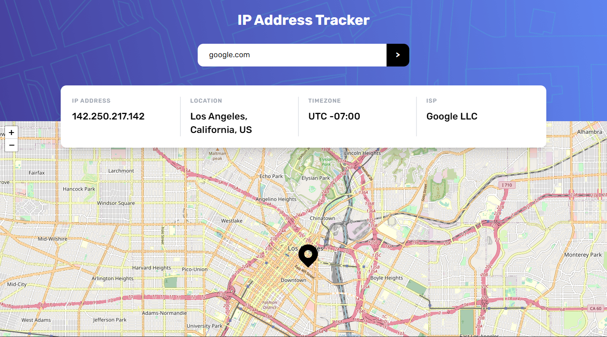

# Frontend Mentor - IP address tracker solution

This is a solution to the [IP address tracker challenge on Frontend Mentor](https://www.frontendmentor.io/challenges/ip-address-tracker-I8-0yYAH0). Frontend Mentor challenges help you improve your coding skills by building realistic projects.

## Table of contents

- [Overview](#overview)
  - [The challenge](#the-challenge)
  - [Screenshot](#screenshot)
  - [Links](#links)
- [Built with](#built-with)
- [Author](#author)
- [Acknowledgments](#acknowledgments)

## Overview

### The challenge

Users should be able to:

- View the optimal layout for each page depending on their device's screen size
- See hover states for all interactive elements on the page
- See their own IP address on the map on the initial page load
- Search for any IP addresses or domains and see the key information and location

### Screenshot

### Links

- Solution URL: [https://www.frontendmentor.io/solutions/ip-address-tracker-k-rt3ydctP](https://www.frontendmentor.io/solutions/ip-address-tracker-k-rt3ydctP)
- Live Site URL: [https://eager-wood.surge.sh/](https://eager-wood.surge.sh/)

## Built with

- Vue 3
- Vue Composition API
- Flexbox
- CSS Grid
- Tailwind CSS
- Vite build tool
- Typescript

## Author

- Frontend Mentor - [@ozamorowski](https://www.frontendmentor.io/profile/ozamorowski)
- Twitter - [@ozamorowski](https://www.twitter.com/ozamorowski)
